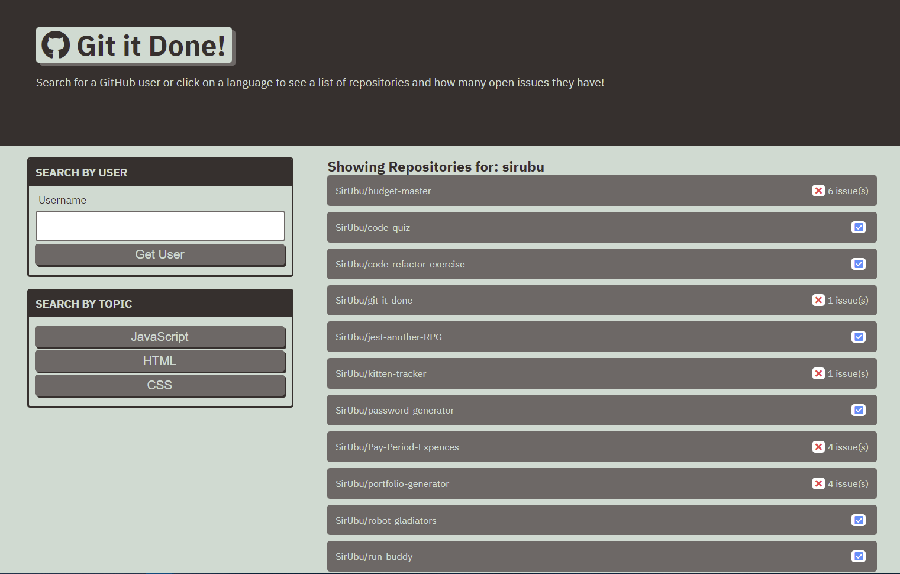

# Git It Done

This application allows the user to search GitHub by user name or preferred language to see a list of open issues that they may be able to contribute to.

## Description

Search by a GitHub user name to get a list of that user's current repositories and if they have open issues.

Click on a preferred language button to get a list of featured repositories with open issues that help is wanted on resolving.

Click on the repository to to a list of the current issues or pull requests.

Click on the issues or pull request to be navigated to the GitHub page of that repository and issues/pull request.

## Screenshot

## Link
https://sirubu.github.io/git-it-done/

## Resources
GitHub API request: https://docs.github.com/en/rest